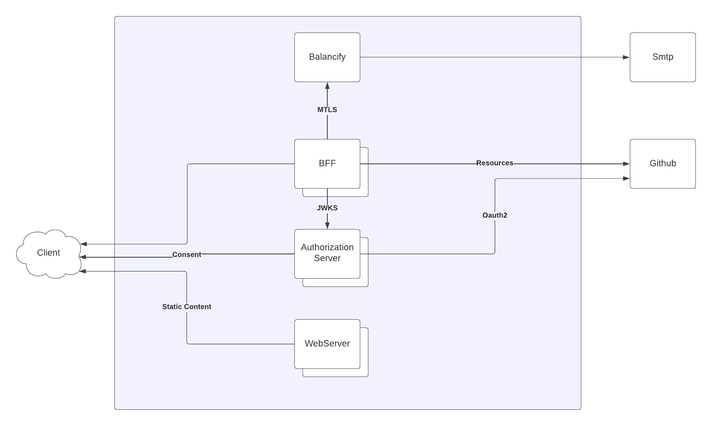

# Balancify

The scope of this project is to generate a summary of the transactions defined in a CSV file. This summary is sent via email. To determine the recipient, an OAuth flow with GitHub is used to access its resources. The transactions are persisted in an RDBMS.

    

## Components

### WebServer

Responsible for serving static content. Code splitting was implemented to serve static files on demand, and etag handling was implemented to encourage browser caching. This server is written in Go, and the static files are embedded in the binary resulting from the compilation. This is where the flow begins, with the client directed to a page to provide consent for the use of specific Github resources.

### Authorization Server

It is responsible for managing the oauth2 flow with Github. It digitally signs the generated tokens asymmetrically using RSA256 and exposes a signature verification endpoint in JWKS format. Furthermore, it provides instructions to the client on securely storing the JWT (JSON Web Token).

### BFF

It caters to the specific needs of the client regarding the acquisition of Github resources. It validates tokens using the endpoint provided by the authorization server. Additionally, consumes the balancify server to generate the client summary and subsequently send it via email.

### Balancify

Generates a summary of transactions received via CSV, after they have been processed, and then sends the summary via email. Access to this service is restricted to mutual TLS (mTLS) for security reasons. In this project, the Backend For Frontend (BFF) is the only entity granted access to these certificates.

## Usage Production

The project is deployed on an on-premise Kubernetes cluster using k3s and Raspberry Pi. It utilizes the domain `fast.ar`. Let's Encrypt was employed to issue TLS certificates, and a private Docker registry at `docker.fast.ar` is used to upload images. The Kubernetes manifests can be found in `deploy/deployment.yaml`, and you need to include `deploy/secrets.yaml`.

You can use the script ./build.sh to build the Docker images, upload them to the local registry, and finally apply the Kubernetes manifests.

The services are accessible via the following subdomains:

- **Web server**: [https://balancify.fast.ar](https://balancify.fast.ar)
- **Authorization server**: [https://authorize.fast.ar](https://authorize.fast.ar)
- **BFF server**: [https://bff.fast.ar](https://bff.fast.ar)
- **Web SMTP**: [https://smtp.fast.ar](https://smtp.fast.ar)

To use the application, visit [https://balancify.fast.ar](https://balancify.fast.ar), log in, upload your file, and submit it. The final email report can be viewed at [https://smtp.fast.ar](https://smtp.fast.ar), which emulates a web interface for email services.

For the database, a cloud-based product was used, and finally, the balancify-server is only accessed within the cluster using mTLS.

## Usage Local

To test it locally, you can run the command "docker compose up". Make sure the .env file sent via email is in the root of the project.

The webserver can be accessed at: http://localhost

The test email web interface is located at: http://localhost:1080

The flow is straightforward: users log in using GitHub, then click on "Load file" to upload the file. Once uploaded, information about the file appears, and they click on the Upload button. Afterward, they can visit the email web interface, which in the case of local testing would be at http://localhost:1080, to view the summary.

